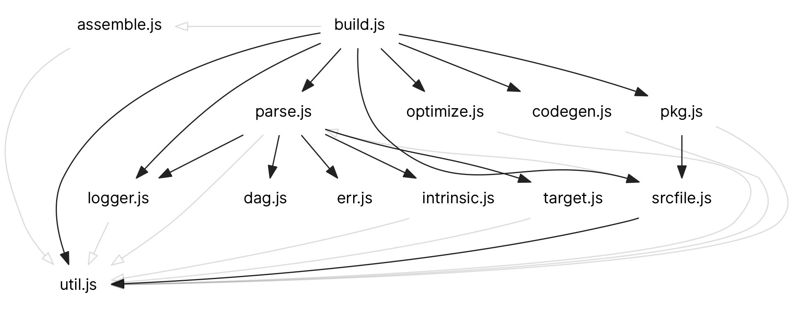

# pkgbuild.js

Simple and fast JavaScript package compiler.

Given a directory of source files, pkgbuild.js produces a single, optimized
javascript file that is compatible with all common JS environments.

**Usage:** Copy
[`pkgbuild.js`](https://raw.githubusercontent.com/rsms/pkgbuild.js/master/pkgbuild.js)
into your project and [configure your build](example/build.js)

#### Outline

- Source code in a directory is treated as a single package/module
  - Filenames are irrelevant and you can organize and re-organize your code
    freely without the need to change any imports or exports internally in your
    package.
  - Automatically resolves the internal dependency order of all your source
    files to order the final source code in the most optimal way possible
  - Elides, inlines and even sometimes completely eliminates code that is
    internal-only for a package, yielding much smaller products.
- Produces small and fast code
  - Supports specific targeting (web browser, nodejs, etc.) for improve code
    generation
  - Can generate source maps
  - Products run in both browsers and commonjs environments like nodejs
  - Can produce multiple targets concurrently, saving build time
- Helps you catch common mistakes
  - Detects use of undefined identifiers and provides suggestions
  - Detects cyclic references to variables, functions, classes etc that would
    lead to indeterministic runtime behavior.
  - Reports diagnostics of unused identifiers
  - Reports diagnostics of possible inter-package dependencies that are resolved
    at runtime (rather than init-time.)
- A simple, single-file library
  - Zero dependencies
  - Built on battle-tested
    [UglifyJS (v2, "harmony")](https://github.com/mishoo/UglifyJS2/tree/harmony)
  - Not a CLI program, but just a library — write
    [your own build file](example/build.js).
  - Simple implementation that's easy to maintain
    (see [`pkgbuild`](pkgbuild) directory)
  - Self-hosted (builds itself)

The [`example`](example) directory contains an example package and build file.

Dependency graph of the source files for pkgbuild itself, generated from calling
`filedepDotGraph()` on build results. The black arrows represent init-time
dependencies while the light-grey arrows represent "soft" runtime references:



#### Stuff that's missing

- Support for `import` is not yet implemented, meaning you have to use whatever
  means are available for the target (i.e. `require` for commonjs and amd.)
- Static linking of other packages

## Built-in intrinsic features

pkgbuild provides a few light-weight built-in features.

- [`assert(condition :any, message? :any)`](#assert)
- [`DEBUG :boolean`](#debug)

Note: If you define any of these names youreself, your definitions are of course
used instead of the built-ins.

### `assert`

`assert(condition :any, message? :any)` provides simple assertion testing
that is only included for target.debug and stripped away for non-debug builds.
This makes it zero cost to drop in `asserts` in as many places as you'd like.

example.js

```js
function firstName(name) {
  assert(name.length > 0, 'empty name')
  return name.split(/\b/, 1)[0]
}
```

Output when compiled with `target.debug=true`:

```js
function assert(... /* definition of built-in function */ }
// ...
function firstName(name) {
  assert(name.length > 0, 'empty name')
  return name.split(/\b/, 1)[0]
}
```

Output when compiled with `target.debug=false`:

```js
function firstName(name) {
  return name.split(/\b/, 1)[0]
}
```

### `DEBUG`

`DEBUG :boolean` is a predefined boolean constant, which is set to true when
`target.debug==true`, and false otherwise. Combined with optimized builds, this
can be used for conditional compilation:

```js
if (DEBUG) {
  let something = timeConsumingCalculation(stuffs)
  console.log(`something: ${something.join(', ')}`)
}

function timeConsumingCalculation(stuffs) {
  let v = []
  for (const n of stuffs) {
    let s = ''
    for (const cstr of String(n)) {
      const c = cstr.codePointAt(0)
      if (c < 0x0061) {
        s += String.fromCodePoint(c)
      }
    }
    v.push(s)
  }
  return v
}
```

If we build this with `target.optlevel > 0` (but not `target.debug`),
_all code_ in this example is eliminated, including `timeConsumingCalculation`
which is left unused after the `if (DEBUG) ...` block is removed:

```js
// empty
```

However, if we build this with `target.optlevel > 0` and `target.debug`,
the compiler might produce something like this:

```js
let something = function(stuffs) {
  let v = [];
  for (const n of stuffs) {
    let s = "";
    for (const cstr of String(n)) {
      const c = cstr.codePointAt(0);
      c < 97 && (s += String.fromCodePoint(c));
    }
    v.push(s);
  }
  return v;
}(greetings);
console.log(`something: ${something.join(", ")}`);
```


## Developing pkgbuild

- First off, run `yarn` or `npm install` to fetch development dependencies.
- Edit the source in the `pkgbuild` directory and run `misc/build-self.sh` to
  rebuild and test

`misc/build-self.sh` uses pkgbuild itself to rebuild itself (it is self-hosting).
This script maintains previous versions of pkbguild so that in case you brick
things, you still have a functioning version of pkgbuild.

If you break the source syntax itself, no new build products are created, so
in that case nothing special happens. However, if you break the program
(runtime), then the broken build products are written to files containing the
string `.latest-build-broken`. A copy of the latest stable (i.e. non-crashing)
build is maintained in the `tmp` directory.

Dependencies can be upgraded using `misc/build-deps.sh`
